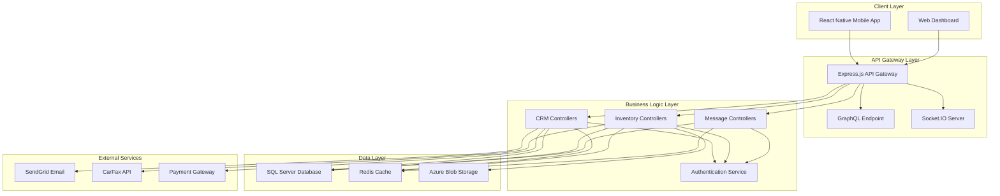
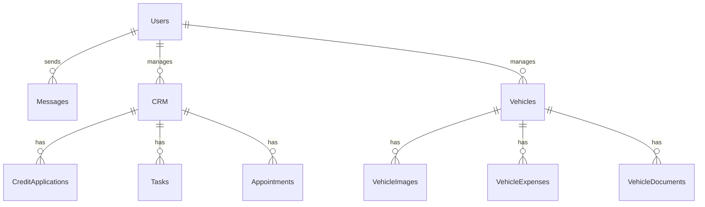
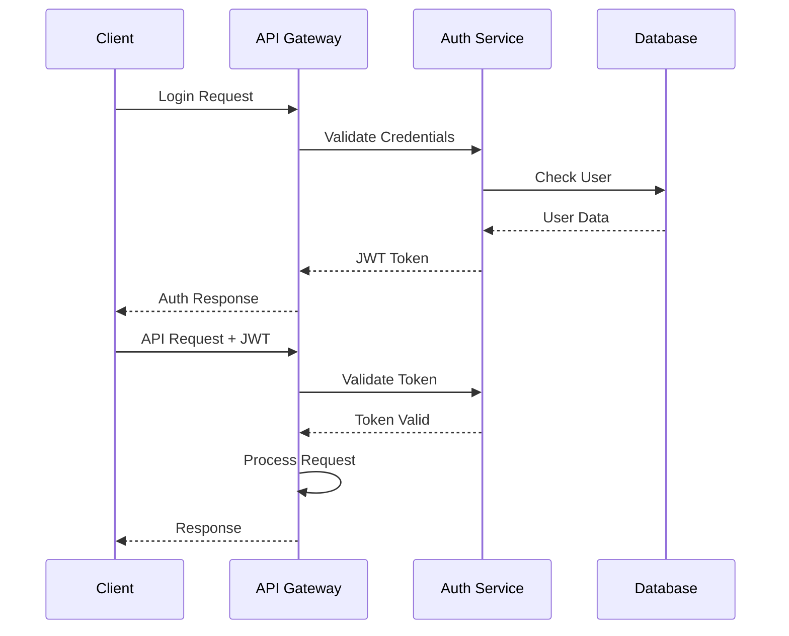
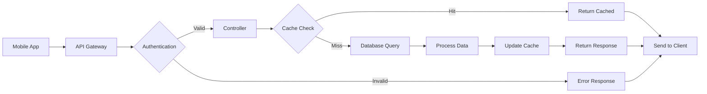
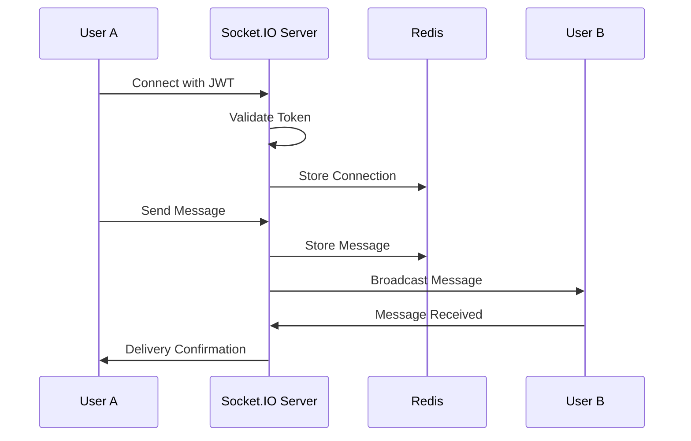

# DealersCloud Architecture Documentation


## 🏗️ System Overview

DealersCloud is a full-stack automotive dealership management platform built with a modern microservices architecture, designed for scalability, maintainability, and high performance.



## 🎯 Architecture Principles

### 1. **Separation of Concerns**
- Clear separation between presentation, business logic, and data layers
- Modular design with dedicated controllers for each domain
- Service-oriented architecture for better maintainability

### 2. **Scalability**
- Stateless API design for horizontal scaling
- Redis caching for improved performance
- Database connection pooling
- Asynchronous processing where applicable

### 3. **Security**
- JWT-based authentication
- Role-based access control (RBAC)
- Input validation and sanitization
- SQL injection prevention
- CORS protection

### 4. **Reliability**
- Comprehensive error handling
- Logging and monitoring
- Database transaction management
- Graceful degradation

## 📱 Frontend Architecture

### React Native Mobile Application

```
frontend/src/
├── Components/           # Reusable UI components
│   ├── Header/
│   ├── PrimaryButton/
│   ├── InputBox/
│   └── ...
├── Screens/             # Screen components
│   ├── AuthFlow/
│   ├── Dashboard/
│   ├── CRM/
│   └── ...
├── Navigation/          # Navigation configuration
│   ├── AppStack.tsx
│   ├── BottomTabNavigation/
│   └── Stack.tsx
├── redux/              # State management
│   ├── store.ts
│   ├── rootReducer.ts
│   └── slices/
├── Services/           # API services
│   ├── api.ts
│   ├── auth.ts
│   └── websocket.ts
├── Utils/              # Utility functions
├── Theme/              # Styling and theming
└── Assets/             # Static assets
```

### State Management Architecture

```typescript
// Redux Store Structure
interface RootState {
  auth: {
    user: User | null;
    token: string | null;
    isAuthenticated: boolean;
  };
  crm: {
    customers: Customer[];
    leads: Lead[];
    loading: boolean;
  };
  inventory: {
    vehicles: Vehicle[];
    filters: FilterState;
    pagination: PaginationState;
  };
  messaging: {
    conversations: Conversation[];
    activeChat: string | null;
    unreadCount: number;
  };
  ui: {
    theme: 'light' | 'dark';
    loading: boolean;
    error: string | null;
  };
}
```

### Navigation Architecture

```typescript
// Navigation Stack Structure
AppStack
├── AuthStack (Unauthenticated)
│   ├── LoginScreen
│   ├── ForgotPasswordScreen
│   └── RegisterScreen
└── MainStack (Authenticated)
    ├── BottomTabNavigator
    │   ├── DashboardTab
    │   ├── CRMTab
    │   ├── InventoryTab
    │   └── MessagesTab
    └── ModalStack
        ├── AddVehicleModal
        ├── CustomerDetailModal
        └── ...
```

## 🖥️ Backend Architecture

### Express.js API Server

```
backend/
├── controllers/         # Business logic controllers
│   ├── crm/
│   │   ├── crmController.js
│   │   ├── addLeadController.js
│   │   └── creditApplication.js
│   ├── inventory/
│   │   ├── carDetailController.js
│   │   ├── addVehicleController.js
│   │   └── expenseController.js
│   ├── userController.js
│   └── messageController.js
├── models/             # Data models and database queries
│   ├── crm/
│   ├── inventory/
│   └── ...
├── routes/             # API route definitions
│   ├── crm/
│   ├── inventory/
│   └── ...
├── middlewares/        # Express middlewares
│   ├── authenticateJWT.js
│   ├── errorHandler.js
│   └── fileUpload.js
├── config/             # Configuration files
│   ├── database.js
│   ├── redis.js
│   └── azure.js
├── utils/              # Utility functions
├── graphql/           # GraphQL schema and resolvers
└── socket/            # WebSocket handlers
```

### API Layer Architecture

#### REST API Structure
```
/api
├── /auth
│   ├── POST /login
│   ├── POST /refresh
│   └── POST /logout
├── /crm
│   ├── GET /customers
│   ├── POST /customers
│   ├── PUT /customers/:id
│   └── DELETE /customers/:id
├── /inventory
│   ├── GET /vehicles
│   ├── POST /vehicles
│   ├── PUT /vehicles/:id
│   └── DELETE /vehicles/:id
└── /messages
    ├── GET /conversations
    ├── POST /messages
    └── DELETE /messages/:id
```

#### GraphQL Schema
```graphql
type Query {
  dashboard: DashboardData
  customers(filters: CustomerFilters): [Customer]
  vehicles(filters: VehicleFilters): [Vehicle]
  messages(conversationId: ID!): [Message]
}

type Mutation {
  addCustomer(input: CustomerInput!): Customer
  addVehicle(input: VehicleInput!): Vehicle
  sendMessage(input: MessageInput!): Message
  updateCustomer(id: ID!, input: CustomerInput!): Customer
}

type Subscription {
  messageAdded(conversationId: ID!): Message
  customerUpdated(id: ID!): Customer
}
```

### Middleware Stack

```javascript
// Express middleware stack (in order)
app.use(helmet());                    // Security headers
app.use(cors(corsOptions));          // CORS handling
app.use(compression());              // Response compression
app.use(rateLimit(rateLimitOptions)); // Rate limiting
app.use(express.json());             // JSON body parsing
app.use(express.urlencoded());       // URL-encoded body parsing
app.use(morgan('combined'));         // Request logging
app.use(authenticateJWT);            // JWT authentication
app.use('/api', routes);             // API routes
app.use(errorHandler);               // Global error handler
```

## 🗄️ Database Architecture

### SQL Server Database Schema

```sql
-- Core Tables Structure

-- Users and Authentication
CREATE TABLE Users (
    UserID INT PRIMARY KEY IDENTITY(1,1),
    Username NVARCHAR(50) UNIQUE NOT NULL,
    PasswordHash NVARCHAR(255) NOT NULL,
    Email NVARCHAR(100) UNIQUE,
    Role NVARCHAR(20) DEFAULT 'User',
    CreatedAt DATETIME2 DEFAULT GETDATE(),
    UpdatedAt DATETIME2 DEFAULT GETDATE()
);

-- Dealership Information
CREATE TABLE Dealership (
    DealershipID INT PRIMARY KEY IDENTITY(1,1),
    DealershipName NVARCHAR(100) NOT NULL,
    Address NVARCHAR(255),
    Phone NVARCHAR(20),
    Email NVARCHAR(100),
    LicenseNumber NVARCHAR(50)
);

-- CRM Tables
CREATE TABLE CRM (
    CustomerID INT PRIMARY KEY IDENTITY(1,1),
    FirstName NVARCHAR(50) NOT NULL,
    LastName NVARCHAR(50) NOT NULL,
    Email NVARCHAR(100),
    Phone NVARCHAR(20),
    Address NVARCHAR(255),
    LeadSourceID INT,
    StatusID INT,
    CreatedAt DATETIME2 DEFAULT GETDATE(),
    UpdatedAt DATETIME2 DEFAULT GETDATE()
);

-- Vehicle Inventory
CREATE TABLE Vehicles (
    VehicleID INT PRIMARY KEY IDENTITY(1,1),
    StockNumber NVARCHAR(50) UNIQUE NOT NULL,
    VIN NVARCHAR(17) UNIQUE,
    Year INT NOT NULL,
    Make NVARCHAR(50) NOT NULL,
    Model NVARCHAR(50) NOT NULL,
    Price DECIMAL(10,2),
    Cost DECIMAL(10,2),
    Mileage INT,
    Status NVARCHAR(20) DEFAULT 'Available',
    CreatedAt DATETIME2 DEFAULT GETDATE()
);

-- Messages and Communication
CREATE TABLE Messages (
    MessageID INT PRIMARY KEY IDENTITY(1,1),
    SenderID INT NOT NULL,
    ReceiverID INT NOT NULL,
    Message NTEXT,
    MessageDate DATETIME2 DEFAULT GETDATE(),
    IsRead BIT DEFAULT 0,
    FOREIGN KEY (SenderID) REFERENCES Users(UserID),
    FOREIGN KEY (ReceiverID) REFERENCES Users(UserID)
);
```

### Database Relationships



### Indexing Strategy

```sql
-- Performance Indexes
CREATE INDEX IX_Users_Username ON Users(Username);
CREATE INDEX IX_Users_Email ON Users(Email);
CREATE INDEX IX_CRM_Email ON CRM(Email);
CREATE INDEX IX_CRM_Phone ON CRM(Phone);
CREATE INDEX IX_CRM_Status ON CRM(StatusID);
CREATE INDEX IX_Vehicles_StockNumber ON Vehicles(StockNumber);
CREATE INDEX IX_Vehicles_VIN ON Vehicles(VIN);
CREATE INDEX IX_Vehicles_Status ON Vehicles(Status);
CREATE INDEX IX_Messages_Conversation ON Messages(SenderID, ReceiverID);
CREATE INDEX IX_Messages_Date ON Messages(MessageDate);
```

## 🚀 Deployment Architecture

### Development Environment
```
Local Machine
├── Node.js Backend (Port 3000)
├── React Native Metro (Port 8081)
├── SQL Server Local DB
├── Redis Local Instance
└── Azure Storage Emulator
```

### Production Environment (Azure)
```
Azure Cloud
├── Azure App Service (Backend)
├── Azure SQL Database
├── Azure Cache for Redis
├── Azure Blob Storage
├── Azure CDN
└── Application Insights (Monitoring)
```

### Container Architecture (Docker)

```dockerfile
# Multi-stage Dockerfile for backend
FROM node:18-alpine AS builder
WORKDIR /app
COPY package*.json ./
RUN npm ci --only=production

FROM node:18-alpine AS runtime
WORKDIR /app
COPY --from=builder /app/node_modules ./node_modules
COPY . .
EXPOSE 3000
CMD ["npm", "start"]
```

## 📊 Performance Architecture

### Caching Strategy

```javascript
// Redis Caching Implementation
const cache = {
  // Dashboard data (30 minutes)
  dashboard: { ttl: 1800, key: 'dashboard:user:' },
  
  // Vehicle listings (15 minutes)
  vehicles: { ttl: 900, key: 'vehicles:page:' },
  
  // Customer data (5 minutes)
  customers: { ttl: 300, key: 'customer:' },
  
  // User sessions (24 hours)
  sessions: { ttl: 86400, key: 'session:' }
};
```

### Load Balancing Strategy

```yaml
# Azure Load Balancer Configuration
load_balancer:
  algorithm: round_robin
  health_checks:
    path: /api/health
    interval: 30s
    timeout: 5s
  instances:
    - app_service_1
    - app_service_2
    - app_service_3
```

## 🔒 Security Architecture

### Authentication Flow



### Role-Based Access Control

```javascript
// RBAC Implementation
const permissions = {
  admin: ['*'], // All permissions
  manager: [
    'crm:read', 'crm:write', 'crm:delete',
    'inventory:read', 'inventory:write',
    'messages:read', 'messages:write'
  ],
  sales: [
    'crm:read', 'crm:write',
    'inventory:read',
    'messages:read', 'messages:write'
  ],
  user: [
    'crm:read',
    'inventory:read',
    'messages:read'
  ]
};
```

## 📈 Monitoring and Analytics

### Application Monitoring

```javascript
// Winston Logging Configuration
const logger = winston.createLogger({
  level: 'info',
  format: winston.format.combine(
    winston.format.timestamp(),
    winston.format.errors({ stack: true }),
    winston.format.json()
  ),
  transports: [
    new winston.transports.File({ filename: 'logs/error.log', level: 'error' }),
    new winston.transports.File({ filename: 'logs/combined.log' }),
    new winston.transports.Console({
      format: winston.format.simple()
    })
  ]
});
```

### Performance Metrics

```javascript
// Key Performance Indicators
const metrics = {
  api_response_time: 'Average API response time',
  db_query_time: 'Database query performance',
  cache_hit_ratio: 'Redis cache effectiveness',
  concurrent_users: 'Active user sessions',
  error_rate: 'Application error percentage',
  uptime: 'Service availability'
};
```

## 🔄 Data Flow Architecture

### Request Processing Flow



### Real-time Communication Flow



## 🚀 Scalability Considerations

### Horizontal Scaling Strategy

1. **Stateless Design**: All API endpoints are stateless
2. **Database Sharding**: Partition data by dealership
3. **Microservices**: Split into domain-specific services
4. **CDN Integration**: Static asset delivery optimization
5. **Auto-scaling**: Based on CPU/memory metrics

### Future Architecture Enhancements

1. **Event-Driven Architecture**: Implement message queues
2. **CQRS Pattern**: Separate read/write operations
3. **API Versioning**: Support multiple API versions
4. **Circuit Breakers**: Fault tolerance patterns
5. **Service Mesh**: Advanced microservices communication

---

**Last Updated**: January 2025  
**Architecture Version**: 1.0.0  
**Document Version**: 1.0.0