# Product Requirements Document (PRD)
## DealersCloud - Automotive Dealership Management Platform


---

## 📋 **Document Information**

| Field | Value |
|-------|-------|
| **Product Name** | DealersCloud (DCAP) |
| **Document Version** | 1.0.0 |
| **Last Updated** | January 15, 2025 |
| **Document Owner** | Product Management Team |
| **Status** | Active Development |
| **Next Review** | March 15, 2025 |

---

## 🎯 **Executive Summary**

### **Product Vision**
To create the most comprehensive, user-friendly, and scalable automotive dealership management platform that empowers dealers to streamline operations, increase sales, and deliver exceptional customer experiences.

### **Mission Statement**
DealersCloud transforms automotive dealership operations through innovative technology, providing a complete CRM, inventory management, and communication solution that drives business growth and operational efficiency.

### **Strategic Goals**
1. **Increase Dealership Revenue** by 30% through improved lead management
2. **Reduce Operational Costs** by 25% through process automation
3. **Improve Customer Satisfaction** by 40% through enhanced communication
4. **Scale Platform Usage** to 1000+ active dealerships within 2 years

---

## 🏢 **Market Analysis**

### **Target Market Size**
- **Total Addressable Market (TAM)**: $12.4B (Global automotive software market)
- **Serviceable Addressable Market (SAM)**: $3.2B (Dealership management software)
- **Serviceable Obtainable Market (SOM)**: $156M (Target market segment)

### **Market Segments**

#### **Primary Target Segments**

<table>
<tr>
<td width="33%">

**Small Dealerships**
- 1-3 locations
- 50-200 vehicles
- 5-15 employees
- $2M-$10M annual revenue

</td>
<td width="33%">

**Medium Dealerships**
- 4-10 locations  
- 200-1000 vehicles
- 15-50 employees
- $10M-$50M annual revenue

</td>
<td width="33%">

**Large Enterprises**
- 10+ locations
- 1000+ vehicles
- 50+ employees  
- $50M+ annual revenue

</td>
</tr>
</table>

#### **Secondary Segments**
- Independent used car lots
- Auto brokers and wholesalers
- Fleet management companies
- Specialty vehicle dealers (motorcycles, RVs, boats)

### **Competitive Landscape**

| Competitor | Strengths | Weaknesses | Our Advantage |
|------------|-----------|------------|---------------|
| **DealerSocket** | Market leader, comprehensive | Expensive, complex | More affordable, mobile-first |
| **CDK Global** | Enterprise features | Legacy system, poor UX | Modern architecture, better UX |
| **Reynolds & Reynolds** | Integrated solutions | Proprietary, expensive | Open architecture, flexible |
| **AutoTrader Solutions** | Marketing integration | Limited CRM features | Complete CRM solution |

---

## 👥 **User Personas**

### **Primary Personas**

#### **1. Sales Manager - "Efficient Emily"**
- **Demographics**: 35-45, College educated, 10+ years automotive experience
- **Goals**: Increase team productivity, track sales performance, manage leads effectively
- **Pain Points**: Manual processes, poor lead tracking, lack of mobile access
- **Usage**: Daily active user, primarily mobile and desktop

#### **2. Sales Representative - "Mobile Mike"**
- **Demographics**: 25-35, High school/Some college, 2-8 years sales experience
- **Goals**: Close more deals, access customer info quickly, communicate effectively
- **Pain Points**: Slow systems, can't access data on the lot, poor mobile experience
- **Usage**: Heavy mobile usage, needs real-time data access

#### **3. General Manager - "Data-Driven David"**
- **Demographics**: 45-55, Business degree, 15+ years management experience
- **Goals**: Optimize operations, increase profitability, make data-driven decisions
- **Pain Points**: Limited reporting, siloed data, expensive software costs
- **Usage**: Dashboard views, reports, strategic planning tools

#### **4. Administrative Staff - "Organized Olivia"**
- **Demographics**: 30-50, Administrative background, detail-oriented
- **Goals**: Process paperwork efficiently, maintain accurate records, support sales team
- **Pain Points**: Manual data entry, document management, system integration issues
- **Usage**: Document management, data entry, record keeping

### **Secondary Personas**

#### **5. Customer - "Car Buying Carl"**
- **Demographics**: 25-65, Various backgrounds, infrequent car buyer
- **Goals**: Find the right vehicle, get fair pricing, smooth transaction process
- **Interaction**: Receives communications, accesses vehicle information
- **Value**: Improved customer service, faster response times

---

## 🚀 **Product Strategy**

### **Product Positioning**
"The modern, mobile-first automotive dealership management platform that increases sales and reduces operational complexity through intelligent automation and real-time communication."

### **Value Propositions**

#### **For Small Dealerships:**
- **Affordable**: 70% less than enterprise solutions
- **Easy Setup**: Go live in 48 hours vs 3-6 months
- **Mobile-First**: Access everything from your phone
- **No Lock-in**: Month-to-month pricing, no long contracts

#### **For Medium Dealerships:**
- **Scalable**: Grows with your business
- **Integrated**: All tools in one platform
- **Customizable**: Adapt to your workflows
- **Analytics**: Make data-driven decisions

#### **For Large Enterprises:**
- **Enterprise-Grade**: Security and compliance
- **Multi-Location**: Centralized management
- **API Integration**: Connect existing systems
- **White-Label**: Custom branding options

### **Differentiation Strategy**

1. **Mobile-First Design**: Native iOS/Android apps vs web-only competitors
2. **Modern Architecture**: Cloud-native, microservices vs legacy systems  
3. **Open Platform**: API-first, integrations vs proprietary solutions
4. **Transparent Pricing**: No hidden fees vs complex pricing models
5. **Developer-Friendly**: Open source components vs black box solutions

---

## 🎯 **Product Goals & Objectives**

### **2025 Goals (Year 1)**

| Goal | Target | Measurement | Priority |
|------|--------|-------------|----------|
| **User Acquisition** | 100 active dealerships | Monthly active users | P0 |
| **Revenue Growth** | $500K ARR | Monthly recurring revenue | P0 |
| **Product Stability** | 99.9% uptime | System availability | P0 |
| **User Satisfaction** | 4.5/5.0 rating | App store ratings, NPS | P1 |
| **Feature Completeness** | Core CRM + Inventory | Feature usage metrics | P1 |
| **Performance** | <200ms API response | Response time monitoring | P1 |

### **2026 Goals (Year 2)**

| Goal | Target | Measurement | Priority |
|------|--------|-------------|----------|
| **Scale Achievement** | 500 active dealerships | User growth rate | P0 |
| **Revenue Milestone** | $2.5M ARR | Revenue growth rate | P0 |
| **Market Expansion** | 3 new market segments | Customer diversity | P1 |
| **Platform Integration** | 20+ third-party APIs | Integration usage | P1 |
| **International** | 2 additional countries | Geographic distribution | P2 |

### **Key Performance Indicators (KPIs)**

#### **Business Metrics**
- **Monthly Recurring Revenue (MRR)**
- **Customer Acquisition Cost (CAC)**
- **Customer Lifetime Value (CLV)**
- **Monthly Churn Rate**
- **Net Promoter Score (NPS)**

#### **Product Metrics**
- **Daily/Monthly Active Users**
- **Feature Adoption Rates**
- **Session Duration**
- **User Retention (Day 1, 7, 30)**
- **Bug Report Rate**

#### **Technical Metrics**
- **System Uptime**
- **API Response Times**
- **App Crash Rate**
- **Database Performance**
- **Security Incidents**

---

## 🎨 **User Experience Strategy**

### **Design Principles**

1. **Mobile-First**: Every feature designed for mobile, then desktop
2. **Simplicity**: Complex workflows made simple and intuitive
3. **Speed**: Fast loading, instant feedback, minimal clicks
4. **Consistency**: Unified design language across all platforms
5. **Accessibility**: WCAG 2.1 AA compliance for inclusive design

### **User Journey Mapping**

#### **Sales Representative Daily Workflow**


### **Information Architecture**


---

## 🛠️ **Technical Requirements**

### **System Architecture**

#### **High-Level Architecture**

```mermaid
graph TB
    subgraph "Client Applications"
        A[📱 iOS App]
        B[📱 Android App] 
        C[🌐 Web Dashboard]
    end
    
    subgraph "API Gateway"
        D[🚀 Express.js API]
        E[📊 GraphQL Endpoint]
        F[⚡ Socket.IO Server]
    end
    
    subgraph "Business Services"
        G[👥 User Service]
        H[🏢 CRM Service]
        I[🚗 Inventory Service]
        J[💬 Message Service]
    end
    
    subgraph "Data Layer"
        K[(🗄️ SQL Server)]
        L[(⚡ Redis Cache)]
        M[☁️ Azure Storage]
    end
    
    subgraph "External APIs"
        N[📧 SendGrid]
        O[🚗 CarFax API]
        P[💳 Payment Gateway]
    end
    
    A --> D
    B --> D
    C --> D
    D --> E
    D --> F
    D --> G
    D --> H
    D --> I
    D --> J
    G --> K
    H --> K
    I --> K
    J --> K
    G --> L
    H --> L
    I --> L
    I --> M
    H --> N
    I --> O
    H --> P
```


### **Technology Stack**

#### **Frontend (Mobile)**
```yaml
Framework: React Native 0.75.2
Language: TypeScript 5.0.4
State Management: Redux Toolkit + Redux Persist
Navigation: React Navigation 7
HTTP Client: Axios
Real-time: Socket.io-client
Storage: MMKV (high performance)
UI Components: Custom + React Native Paper
Charts: React Native Gifted Charts
Chat: React Native Gifted Chat
Camera: React Native Vision Camera
```

#### **Backend (API)**
```yaml
Framework: Express.js 4.21.2
Language: JavaScript (Node.js 18+)
Database: Microsoft SQL Server 2019+
Cache: Redis 6.0+
Authentication: JWT + bcrypt
File Storage: Azure Blob Storage
Email: SendGrid
Documentation: Swagger/OpenAPI
Testing: Jest + Supertest
Logging: Winston
Security: Helmet, CORS, Rate Limiting
```

#### **Infrastructure**
```yaml
Cloud Provider: Microsoft Azure
App Service: Azure App Service
Database: Azure SQL Database
Cache: Azure Cache for Redis
Storage: Azure Blob Storage
CDN: Azure CDN
Monitoring: Application Insights
CI/CD: GitHub Actions
Container: Docker support
```

### **Performance Requirements**

| Metric | Target | Measurement |
|--------|--------|-------------|
| **API Response Time** | < 200ms (95th percentile) | Application monitoring |
| **App Launch Time** | < 3 seconds | Mobile app metrics |
| **Database Query Time** | < 100ms average | SQL Server monitoring |
| **File Upload Speed** | 10MB in < 30 seconds | Upload monitoring |
| **Concurrent Users** | 100+ simultaneous | Load testing |
| **System Uptime** | 99.9% availability | Uptime monitoring |

### **Security Requirements**

#### **Authentication & Authorization**
- **JWT Tokens**: Secure token-based authentication
- **Role-Based Access Control (RBAC)**: Granular permission system
- **Password Policy**: Strong password requirements
- **Session Management**: Secure session handling with Redis
- **Multi-Factor Authentication**: Planned for v1.1

#### **Data Security**
- **Encryption at Rest**: SQL Server TDE + Azure Storage encryption
- **Encryption in Transit**: TLS 1.3 for all connections
- **Input Validation**: Comprehensive sanitization
- **SQL Injection Prevention**: Parameterized queries
- **XSS Protection**: Input/output sanitization

#### **Compliance**
- **GDPR**: European data protection regulation
- **CCPA**: California privacy law
- **SOX**: Financial reporting compliance (if applicable)
- **OWASP**: Top 10 security practices

---

## 📋 **Functional Requirements**

### **Core Features (MVP)**

#### **1. User Management & Authentication**

**FR-001: User Registration & Login**
- Users can create accounts with email/password
- Email verification required for new accounts
- Password reset functionality via email
- Remember me functionality
- Account lockout after failed attempts

**FR-002: Role-Based Access Control**
- Admin: Full system access and user management
- Manager: CRM, inventory, and team management
- Sales: Customer interaction and lead management  
- User: Read-only access to assigned data

**FR-003: User Profile Management**
- Users can update personal information
- Profile photo upload and management
- Password change functionality
- Notification preferences

#### **2. CRM (Customer Relationship Management)**

**FR-004: Lead Management**
- Create new leads with customer information
- Lead source tracking and attribution
- Lead status management (New, Contacted, Qualified, etc.)
- Lead assignment to sales representatives
- Lead scoring and prioritization

**FR-005: Customer Management**
- Comprehensive customer profiles
- Contact information management
- Interaction history tracking
- Customer notes and tags
- Customer search and filtering

**FR-006: Task & Activity Management**
- Create tasks with due dates and priorities
- Appointment scheduling and calendar integration
- Activity logging (calls, emails, meetings)
- Task assignment to team members
- Automated task reminders

**FR-007: Communication Management**
- Email integration with templates
- SMS messaging capabilities (future)
- Call logging and notes
- Communication history tracking
- Automated follow-up sequences

#### **3. Inventory Management**

**FR-008: Vehicle Management**
- Vehicle catalog with detailed specifications
- Stock number and VIN tracking
- Vehicle photos and videos
- Pricing and cost management
- Vehicle status tracking (Available, Sold, Service)

**FR-009: Inventory Organization**
- Advanced search and filtering
- Bulk operations (pricing, status updates)
- Vehicle comparison features
- Inventory alerts (low stock, aging inventory)
- Vehicle document attachments

**FR-010: Expense Tracking**
- Vehicle-specific expense recording
- Expense categories and reporting
- Cost basis calculations
- Profit margin analysis
- Expense receipt attachments

#### **4. Real-Time Communication**

**FR-011: Internal Messaging**
- User-to-user messaging
- Group chat functionality
- Message history and search
- File sharing in conversations
- Online/offline status indicators

**FR-012: Customer Communication**
- Customer chat interface
- Automated responses
- Chat history management
- File sharing with customers
- Integration with CRM records

#### **5. Document Management**

**FR-013: File Storage**
- Document upload and storage
- File categorization and tagging
- Version control for documents
- Secure file sharing
- Document preview capabilities

**FR-014: Document Organization**
- Folder structure management
- Search within document content
- Access control per document
- Bulk document operations
- Document templates

#### **6. Dashboard & Analytics**

**FR-015: Business Dashboard**
- Key performance indicators (KPIs)
- Sales metrics and goals
- Inventory summaries
- Recent activity feed
- Quick action buttons

**FR-016: Reporting System**
- Sales performance reports
- Inventory aging reports
- Lead conversion analytics
- Custom report builder
- Automated report scheduling

### **Advanced Features (Post-MVP)**

#### **Integration Capabilities**
- **CarFax Integration**: Vehicle history reports
- **Payment Processing**: Credit card and financing
- **Accounting Software**: QuickBooks, Xero integration
- **Marketing Tools**: Email marketing, social media
- **Third-Party APIs**: Custom integrations

#### **Advanced Analytics**
- **Predictive Analytics**: Lead scoring, sales forecasting
- **AI Insights**: Customer behavior analysis
- **Performance Benchmarking**: Industry comparisons
- **Advanced Reporting**: Custom dashboards, data visualization

#### **Workflow Automation**
- **Automated Lead Assignment**: Based on rules and availability
- **Follow-up Automation**: Scheduled communications
- **Inventory Alerts**: Automated notifications
- **Task Automation**: Recurring tasks and reminders

---

## 🎨 **Non-Functional Requirements**

### **Performance Requirements**

**NFR-001: Response Time**
- Mobile app screens load within 2 seconds
- API endpoints respond within 200ms (95th percentile)
- Database queries complete within 100ms average
- File uploads process at minimum 1MB/second

**NFR-002: Scalability**
- System supports 100+ concurrent users
- Database handles 1M+ records per table
- API handles 1000+ requests per minute
- Storage scales to 100GB+ per dealership

**NFR-003: Availability**
- System uptime of 99.9% (8.76 hours downtime/year)
- Planned maintenance windows < 4 hours/month
- Recovery time objective (RTO) < 4 hours
- Recovery point objective (RPO) < 1 hour

### **Security Requirements**

**NFR-004: Authentication Security**
- Password complexity requirements enforced
- Session timeout after 24 hours of inactivity
- Account lockout after 5 failed login attempts
- Two-factor authentication available

**NFR-005: Data Protection**
- All data encrypted at rest using AES-256
- All communications encrypted using TLS 1.3
- Personal data handling complies with GDPR
- Audit logs maintained for all data access

**NFR-006: Access Control**
- Role-based permissions enforced
- Data segregation between dealerships
- API rate limiting prevents abuse
- Administrative actions require approval

### **Usability Requirements**

**NFR-007: User Interface**
- Mobile app follows platform design guidelines
- Responsive design supports all screen sizes
- Maximum 3 taps to reach any core function
- Consistent user experience across platforms

**NFR-008: Accessibility**
- WCAG 2.1 AA compliance for web interfaces
- Screen reader compatibility
- High contrast mode support
- Keyboard navigation support

**NFR-009: Localization**
- Support for US English (initial release)
- Currency formatting for USD
- Date/time formatting for US locale
- Future support for multiple languages planned

---

## 🗂️ **Data Requirements**

### **Data Models**

#### **Core Entities**


### **Data Storage Requirements**

#### **Volume Estimates**
- **Users**: 1,000 users across all dealerships
- **Customers**: 100,000 customer records (100 per dealership average)
- **Vehicles**: 50,000 vehicle records (50 per dealership average)
- **Messages**: 1M messages (1,000 per user average)
- **Documents**: 10GB storage (10MB per dealership average)

#### **Growth Projections**
- **Year 1**: 100 dealerships, 10K customers, 5K vehicles
- **Year 2**: 500 dealerships, 50K customers, 25K vehicles  
- **Year 3**: 1,000 dealerships, 100K customers, 50K vehicles

#### **Data Retention**
- **Customer Data**: Retained per legal requirements (7 years)
- **Vehicle Data**: Retained indefinitely for historical analysis
- **Messages**: Retained for 2 years, then archived
- **Audit Logs**: Retained for 7 years for compliance
- **File Uploads**: Retained until explicitly deleted

### **Data Integration**

#### **Import Capabilities**
- **CSV Import**: Customer lists, vehicle inventory
- **API Integration**: Real-time data from third-party systems
- **File Upload**: Document and image batch uploads
- **Data Migration**: Tools for migrating from existing systems

#### **Export Capabilities**
- **CSV Export**: All major data entities
- **API Access**: RESTful API for data extraction
- **Reporting**: Automated report generation and delivery
- **Backup**: Automated database backups

---

## 🚦 **Product Roadmap**

### **Release Timeline**


### **Version 1.0 (Current) - Foundation**
**Release Date**: January 15, 2025
**Status**: ✅ Released

**Core Features:**
- ✅ User authentication and role management
- ✅ Basic CRM with lead and customer management
- ✅ Vehicle inventory management with photos
- ✅ Real-time messaging between users
- ✅ Document upload and management
- ✅ Basic dashboard and reporting
- ✅ Mobile app for iOS and Android
- ✅ RESTful API with Swagger documentation

### **Version 1.1 - Enhancement** 
**Target Release**: March 15, 2025
**Status**: 🚧 In Development

**Planned Features:**
- 🔐 Multi-factor authentication
- 📊 Advanced reporting and analytics
- 🔔 Push notification system
- 🔗 Third-party API integrations (CarFax, SendGrid)
- 📱 Biometric authentication for mobile
- 🎨 UI/UX improvements and dark mode
- ⚡ Performance optimizations

### **Version 1.2 - Automation**
**Target Release**: June 15, 2025  
**Status**: 📋 Planned

**Planned Features:**
- 🤖 Workflow automation engine
- 📈 Predictive analytics and AI insights
- 🎨 White-label customization options
- 📴 Offline mode for mobile apps
- 🔄 Advanced data synchronization
- 📊 Custom dashboard builder
- 🌐 Webhook support for integrations

### **Version 2.0 - Intelligence**
**Target Release**: September 15, 2025
**Status**: 🔮 Future

**Planned Features:**
- 🤖 AI-powered lead scoring and recommendations
- 🌍 Multi-language and localization support
- 🏢 Enterprise features (SSO, advanced security)
- 📊 Business intelligence and data warehousing
- 🔄 Advanced workflow designer
- 🎯 Marketing automation integration
- 📱 Progressive Web App (PWA) version

### **Feature Priority Matrix**

| Feature | Business Value | Technical Effort | User Demand | Priority |
|---------|----------------|------------------|-------------|----------|
| Multi-factor Authentication | High | Medium | High | P0 |
| Advanced Reporting | High | High | High | P0 |
| Push Notifications | Medium | Medium | High | P1 |
| CarFax Integration | High | Medium | Medium | P1 |
| Workflow Automation | High | High | Medium | P1 |
| White-label Options | Medium | High | Low | P2 |
| AI Features | High | High | Low | P2 |
| Multi-language | Medium | High | Low | P3 |

---

## ⚠️ **Risks & Mitigation Strategies**

### **Technical Risks**

| Risk | Probability | Impact | Mitigation Strategy |
|------|-------------|--------|-------------------|
| **Database Performance Issues** | Medium | High | Implement proper indexing, query optimization, connection pooling |
| **Mobile App Store Rejections** | Low | Medium | Follow platform guidelines, thorough testing, staged releases |
| **Security Vulnerabilities** | Low | High | Regular security audits, penetration testing, OWASP compliance |
| **Third-party API Changes** | Medium | Medium | Version management, fallback options, SLA monitoring |
| **Scalability Bottlenecks** | Medium | High | Load testing, horizontal scaling design, performance monitoring |

### **Business Risks**

| Risk | Probability | Impact | Mitigation Strategy |
|------|-------------|--------|-------------------|
| **Market Competition** | High | Medium | Focus on differentiation, rapid feature development, customer retention |
| **Economic Downturn** | Medium | High | Flexible pricing models, cost management, diverse market segments |
| **Customer Acquisition Costs** | Medium | Medium | Referral programs, content marketing, partnership channels |
| **Regulatory Changes** | Low | Medium | Legal compliance monitoring, privacy-first design, audit trails |
| **Key Personnel Loss** | Low | High | Documentation, knowledge sharing, succession planning |

### **Product Risks**

| Risk | Probability | Impact | Mitigation Strategy |
|------|-------------|--------|-------------------|
| **Feature Scope Creep** | Medium | Medium | Clear requirements, change management process, regular reviews |
| **User Adoption Issues** | Low | High | User research, usability testing, onboarding optimization |
| **Integration Complexity** | Medium | Medium | API-first design, standard protocols, thorough documentation |
| **Performance Degradation** | Medium | High | Continuous monitoring, performance testing, optimization cycles |
| **Data Migration Issues** | Low | High | Comprehensive testing, rollback plans, customer support |

---

## 🎯 **Success Metrics & KPIs**

### **Business Success Metrics**

#### **Revenue Metrics**
- **Monthly Recurring Revenue (MRR)**: Target $500K by end of Year 1
- **Annual Recurring Revenue (ARR)**: Target $2.5M by end of Year 2  
- **Customer Acquisition Cost (CAC)**: Target <$500 per customer
- **Customer Lifetime Value (CLV)**: Target >$5,000 per customer
- **CLV/CAC Ratio**: Target >10:1

#### **Growth Metrics**
- **Active Dealerships**: Target 100 (Year 1), 500 (Year 2)
- **Monthly Active Users**: Target 1,000 (Year 1), 5,000 (Year 2)
- **User Growth Rate**: Target 20% month-over-month
- **Market Share**: Target 2% of TAM by Year 3

#### **Customer Success Metrics**
- **Net Promoter Score (NPS)**: Target >50
- **Customer Satisfaction (CSAT)**: Target >4.5/5.0
- **Customer Churn Rate**: Target <5% monthly
- **Feature Adoption Rate**: Target >70% for core features
- **Support Ticket Volume**: Target <10 tickets per 100 users/month

### **Product Success Metrics**

#### **Usage Metrics**
- **Daily Active Users (DAU)**: Target 40% of registered users
- **Monthly Active Users (MAU)**: Target 80% of registered users
- **Session Duration**: Target >15 minutes average
- **Features per Session**: Target >3 features used per session
- **User Retention**: Target 90% Day 1, 70% Day 7, 50% Day 30

#### **Performance Metrics**
- **App Store Ratings**: Target >4.5 stars (iOS & Android)
- **System Uptime**: Target >99.9%
- **API Response Time**: Target <200ms (95th percentile)
- **Bug Report Rate**: Target <1% of active users report bugs
- **Crash Rate**: Target <0.1% of app sessions

#### **Engagement Metrics**
- **Messages Sent**: Target 50+ messages per active user per month
- **Documents Uploaded**: Target 20+ documents per dealership per month
- **Reports Generated**: Target 10+ reports per dealership per month
- **API Calls**: Target 1,000+ API calls per dealership per month

---

## 📞 **Stakeholder Communication**

### **Key Stakeholders**

#### **Internal Stakeholders**
- **Product Owner**: @ammanabbasi - Final product decisions, roadmap priority
- **Development Team**: Engineering team - Technical implementation
- **QA Team**: Quality assurance team - Testing and validation
- **Customer Success**: Support team - User feedback and issues
- **Business Development**: Sales and marketing - Go-to-market strategy

#### **External Stakeholders**
- **Early Customers**: Beta testing dealerships - Feature feedback and validation
- **Advisory Board**: Industry experts - Strategic guidance and networking
- **Investors**: Funding partners - Business performance and growth metrics
- **Technology Partners**: Integration partners - API cooperation and support

### **Communication Cadence**

| Stakeholder Group | Meeting Type | Frequency | Purpose |
|-------------------|--------------|-----------|---------|
| **Development Team** | Sprint Planning | Weekly | Task assignment and progress review |
| **Customer Success** | User Feedback Review | Bi-weekly | Customer insights and support issues |
| **Advisory Board** | Strategy Review | Monthly | Product direction and market validation |
| **Early Customers** | Product Demo | Monthly | Feature showcase and feedback collection |
| **All Stakeholders** | Release Review | Quarterly | Major releases and performance metrics |

---

## 📚 **Appendices**

### **Appendix A: Market Research Data**

#### **Automotive Software Market Analysis**
- Market size: $12.4B globally, growing at 15.2% CAGR
- Key drivers: Digital transformation, mobile adoption, data analytics
- Regional breakdown: North America (45%), Europe (30%), Asia-Pacific (25%)
- Customer segments: New car dealers (60%), Used car dealers (40%)

#### **Competitive Pricing Analysis**
| Competitor | Starting Price | Enterprise Price | Key Features |
|------------|----------------|------------------|--------------|
| DealerSocket | $299/month | $1,500+/month | Full DMS, CRM, Inventory |
| CDK Global | $500/month | $2,000+/month | Integrated solutions |
| Reynolds & Reynolds | $400/month | $1,800+/month | Legacy DMS |
| **DealersCloud** | **$99/month** | **$499/month** | Modern platform |

### **Appendix B: Technical Architecture Details**

#### **Database Schema**
- Complete entity relationship diagrams
- Table structures and relationships
- Index optimization strategies
- Data archival and purging policies

#### **API Specifications**
- OpenAPI 3.0 specification
- Authentication and authorization flows
- Rate limiting and throttling policies
- Error handling and status codes

#### **Security Implementation**
- Authentication mechanisms
- Data encryption standards
- Network security protocols
- Compliance certifications

### **Appendix C: User Research Findings**

#### **Customer Interview Insights**
- Primary pain points in current solutions
- Feature prioritization from user perspective
- Pricing sensitivity analysis
- Integration requirements

#### **Usability Testing Results**
- Task completion rates
- User satisfaction scores
- Common usability issues
- Recommended improvements

---

## 📝 **Document History**

| Version | Date | Changes | Author |
|---------|------|---------|--------|
| 1.0.0 | 2025-01-15 | Initial PRD creation | Product Team |
| 1.0.1 | 2025-01-20 | Added technical requirements section | Technical Lead |
| 1.0.2 | 2025-01-25 | Updated market analysis data | Business Analyst |

---

<div align="center">

**📋 This PRD is a living document and will be updated as the product evolves.**

**For questions or feedback on this PRD, contact**: [product@dealerscloud.com](mailto:product@dealerscloud.com)

---

*© 2025 DealersCloud. All rights reserved.*

</div>