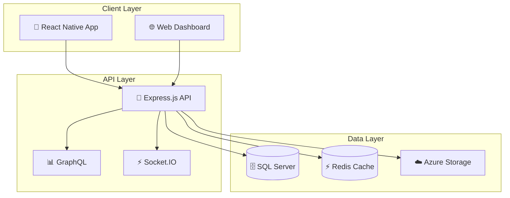

# DealersCloud (DCAP) - Automotive Dealership Management Platform


[](https://github.com/ammanabbasi/DCAP/releases)
[](https://nodejs.org/)
[](https://reactnative.dev/)
[](LICENSE.md)
[](CONTRIBUTING.md)

> **A comprehensive, full-stack automotive dealership management platform built with React Native and Express.js, designed to streamline CRM operations, inventory management, and real-time communication for automotive businesses.**

---

## 🌟 **Features at a Glance**

<table>
<tr>
<td width="33%">

### 🏢 **CRM System**
- Customer lead management
- Contact history tracking
- Task & appointment scheduling
- Credit application processing
- Email integration with templates

</td>
<td width="33%">

### 🚗 **Inventory Management**
- Vehicle catalog with images
- Stock & VIN tracking
- Expense management
- CarFax integration ready
- Document attachments

</td>
<td width="33%">

### 💬 **Real-time Communication**
- WebSocket messaging
- User presence indicators
- Message history & search
- File sharing capabilities
- Push notifications ready

</td>
</tr>
</table>

---

## 🎯 **Why DealersCloud?**

**For Automotive Dealerships:**
- 📈 **Increase Sales**: Streamlined lead management and customer tracking
- ⚡ **Improve Efficiency**: Automated workflows and real-time communication  
- 📊 **Better Analytics**: Comprehensive dashboard with business insights
- 🔒 **Enterprise Security**: Role-based access control and data protection
- 📱 **Mobile-First**: Native iOS and Android apps for on-the-go access

**For Developers:**
- 🏗️ **Modern Architecture**: Microservices design with scalable cloud integration
- 🛠️ **Full-Stack**: Complete React Native + Express.js solution
- 📚 **Well Documented**: Comprehensive guides and API documentation
- 🧪 **Test Ready**: Built-in testing framework and CI/CD support
- 🌍 **Open Source**: MIT licensed for customization and extension

---

## 🚀 **Quick Start**

### **Prerequisites**
- Node.js 18+ 
- React Native development environment
- SQL Server (2019+ or Azure SQL Database)
- Redis (6.0+ for caching)

### **Installation**

```bash
# 1. Clone the repository
git clone https://github.com/ammanabbasi/DCAP.git
cd DCAP

# 2. Install backend dependencies
cd backend && npm install

# 3. Install frontend dependencies
cd ../frontend && npm install

# 4. Setup environment variables
cp backend/.env.example backend/.env
cp frontend/.env.example frontend/.env
# Edit .env files with your configuration

# 5. Start the application
# Terminal 1 - Backend API
cd backend && npm run dev

# Terminal 2 - React Native Metro
cd frontend && npm start

# Terminal 3 - Mobile App
npm run android  # or npm run ios
```

### **First Launch**
1. Access the API documentation at `http://localhost:3000/api-docs`
2. Create your first user account through the mobile app
3. Configure your dealership settings in the admin panel

**📖 Need detailed setup instructions?** → [Installation Guide](INSTALLATION_GUIDE.md)

---

## 📱 **Screenshots & Demo**

<table>
<tr>
<td align="center" width="25%">

<br><strong>Dashboard</strong>
</td>
<td align="center" width="25%">

<br><strong>CRM Management</strong>
</td>
<td align="center" width="25%">

<br><strong>Inventory</strong>
</td>
<td align="center" width="25%">

<br><strong>Messaging</strong>
</td>
</tr>
</table>

> *Screenshots will be updated with actual app interface once available*

**🎥 Want to see it in action?** → [Request a Demo](mailto:demo@dealerscloud.com)

---

## 🏗️ **System Architecture**



**🏛️ Want to understand the full architecture?** → [Architecture Documentation](ARCHITECTURE.md)

---

## 📊 **Project Status & Roadmap**

### **Current Status: v1.0.0** ✅

**Core Features Complete:**
- ✅ User authentication & authorization
- ✅ CRM lead management system
- ✅ Vehicle inventory management
- ✅ Real-time messaging platform  
- ✅ Document management system
- ✅ Dashboard analytics
- ✅ Mobile app (iOS & Android)
- ✅ RESTful API with documentation

### **Coming Soon: v1.1.0** 🚧

- 🔐 Multi-factor authentication
- 📊 Advanced reporting dashboard  
- 🔗 Third-party API integrations
- 📱 Biometric authentication
- 🔔 Push notification system
- 📴 Offline mode support

### **Future Releases** 🔮

- 🤖 AI-powered lead scoring
- 📈 Predictive analytics
- 🎨 White-label customization
- 🌍 Multi-language support
- 🔄 Advanced workflow automation

**📋 See the complete roadmap** → [Project Requirements Document](PRD.md)

---

## 🛠️ **Technology Stack**

<table>
<tr>
<td width="50%">

**Frontend (Mobile)**
```
📱 React Native 0.75.2
🎯 TypeScript 5.0.4
🏪 Redux Toolkit + Persist
🧭 React Navigation 7
📊 Gifted Charts
💬 Gifted Chat
📱 MMKV Storage
```

</td>
<td width="50%">

**Backend (API)**
```
🚀 Express.js 4.21.2
🗄️ SQL Server 2022
⚡ Redis 6.0+
☁️ Azure Blob Storage
📧 SendGrid Email
📊 GraphQL + REST
```

</td>
</tr>
</table>

**Development Tools:**
- 🧪 Jest Testing Framework
- 📝 ESLint + Prettier
- 🐋 Docker Support  
- 📖 Swagger/OpenAPI Docs
- 📈 Application Insights

**🔧 Need help with setup?** → [Installation Guide](INSTALLATION_GUIDE.md)

---

## 📖 **Documentation**

Our documentation is comprehensive and developer-friendly:

| Document | Description |
|----------|-------------|
| 📖 [Installation Guide](INSTALLATION_GUIDE.md) | Complete setup instructions for all platforms |
| 🏛️ [Architecture Guide](ARCHITECTURE.md) | System design and technical architecture |  
| 🔌 [API Documentation](API_DOCUMENTATION.md) | Complete REST API reference with examples |
| 🤝 [Contributing Guide](CONTRIBUTING.md) | How to contribute to the project |
| 🔒 [Security Policy](SECURITY.md) | Security guidelines and vulnerability reporting |
| ❓ [FAQ](FAQ.md) | 50+ frequently asked questions and answers |
| 📝 [Changelog](CHANGELOG.md) | Version history and release notes |
| 📋 [PRD](PRD.md) | Product requirements and roadmap |

**💡 Quick Links:**
- 🚀 [Getting Started](#quick-start)
- 🔧 [API Reference](API_DOCUMENTATION.md)
- 🐛 [Report Bug](https://github.com/ammanabbasi/DCAP/issues/new?template=bug_report.md)
- ✨ [Request Feature](https://github.com/ammanabbasi/DCAP/issues/new?template=feature_request.md)

---

## 🤝 **Contributing**

We welcome contributions from developers, automotive industry experts, and UX designers!

### **Ways to Contribute:**
- 🐛 **Report bugs** using our [bug report template](https://github.com/ammanabbasi/DCAP/issues/new?template=bug_report.md)
- ✨ **Request features** with our [feature request template](https://github.com/ammanabbasi/DCAP/issues/new?template=feature_request.md)
- 📝 **Improve documentation** 
- 🧪 **Add tests** and improve code quality
- 🎨 **Enhance UI/UX** design
- 🌍 **Add translations** for internationalization

### **Development Workflow:**
```bash
# 1. Fork the repository
# 2. Create a feature branch
git checkout -b feature/amazing-feature

# 3. Make your changes
# 4. Run tests
npm test

# 5. Submit a pull request
```

**📚 Read our detailed contributing guide** → [Contributing Guidelines](CONTRIBUTING.md)

---

## 🏆 **Community & Support**

### **Get Help:**
- 📚 **Documentation**: Start with our [FAQ](FAQ.md)
- 💬 **Discussions**: [GitHub Discussions](https://github.com/ammanabbasi/DCAP/discussions)
- 🐛 **Bug Reports**: [GitHub Issues](https://github.com/ammanabbasi/DCAP/issues)
- 📧 **Email Support**: support@dealerscloud.com

### **Stay Connected:**
- ⭐ **Star this repo** to show your support
- 👀 **Watch** for updates and new releases
- 🔄 **Share** with your network in the automotive industry

### **Enterprise Support:**
- 🏢 **Custom deployment** assistance
- 🔧 **Feature development** and customization
- 📞 **Priority support** channels
- 📈 **Training and consulting**

**Contact us:** enterprise@dealerscloud.com

---

## 🔒 **Security**

Security is a top priority for DealersCloud:

- 🔐 **JWT Authentication** with secure token management
- 🛡️ **Role-based Access Control** for fine-grained permissions  
- 🔒 **Data Encryption** at rest and in transit
- 🚨 **Security Monitoring** and audit logging
- 📋 **OWASP Compliance** following security best practices

**🔒 Found a security issue?** → [Security Policy](SECURITY.md)

---

## 📊 **Performance & Scalability**

**Performance Metrics:**
- ⚡ API Response Time: < 200ms average
- 📱 App Startup: < 3 seconds
- 🗄️ Database Queries: < 100ms average
- 👥 Concurrent Users: 100+ supported

**Scalability Features:**
- 🔄 Stateless API design for horizontal scaling
- ⚡ Redis caching for improved performance  
- 🏗️ Microservices architecture ready
- ☁️ Cloud-native Azure integration
- 📊 Database connection pooling

---

## 🏢 **Use Cases**

DealersCloud is perfect for:

### **Small to Medium Dealerships:**
- 🚗 Independent car dealers
- 🏪 Used car lots
- 🚚 Specialty vehicle dealers
- 🏍️ Motorcycle dealerships

### **Large Enterprises:**
- 🏢 Multi-location dealership groups
- 🚗 Franchise dealerships  
- 🚚 Fleet management companies
- 🔧 Auto service centers

### **Industry Professionals:**
- 💼 Auto brokers
- 📊 Automotive consultants
- 📈 Sales managers
- 👥 CRM administrators

---

## 🌟 **Success Stories**

> *"DealersCloud transformed our lead management process. We've seen a 40% increase in conversion rates since implementing the system."*
> 
> **— Sarah Johnson, Sales Manager at Metro Auto Group**

> *"The mobile app allows our sales team to access customer information and inventory on the lot. It's been a game-changer for our business."*
> 
> **— Michael Chen, Owner of Chen's Used Cars**

*Want to share your success story?* → [Contact us](mailto:success@dealerscloud.com)

---

## 📝 **License**

This project is licensed under the **MIT License** - see the [LICENSE.md](LICENSE.md) file for details.

**What this means:**
- ✅ **Commercial use** allowed
- ✅ **Modification** and **distribution** permitted
- ✅ **Private use** allowed
- ❗ **No warranty** or liability

---

## 🙏 **Acknowledgments**

Special thanks to:

- **Contributors** who have helped build and improve DealersCloud
- **Automotive industry experts** who provided valuable feedback
- **Open source community** for the amazing tools and libraries
- **Beta testers** who helped identify and resolve issues

### **Built With:**
- [React Native](https://reactnative.dev/) - The mobile framework
- [Express.js](https://expressjs.com/) - The backend framework  
- [SQL Server](https://www.microsoft.com/sql-server) - The database platform
- [Azure](https://azure.microsoft.com/) - Cloud infrastructure
- [Redux Toolkit](https://redux-toolkit.js.org/) - State management

---

## 📈 **Stats & Analytics**


---

<div align="center">

## **Ready to revolutionize your automotive dealership management?**

### [🚀 Get Started Now](#quick-start) | [📖 Read the Docs](INSTALLATION_GUIDE.md) | [🤝 Contribute](CONTRIBUTING.md) | [💬 Join Discussion](https://github.com/ammanabbasi/DCAP/discussions)

---

**Made with ❤️ by the DealersCloud Team**

[⭐ Star this repository](https://github.com/ammanabbasi/DCAP) if you found it helpful!

---

*© 2025 DealersCloud. All rights reserved.*

</div>