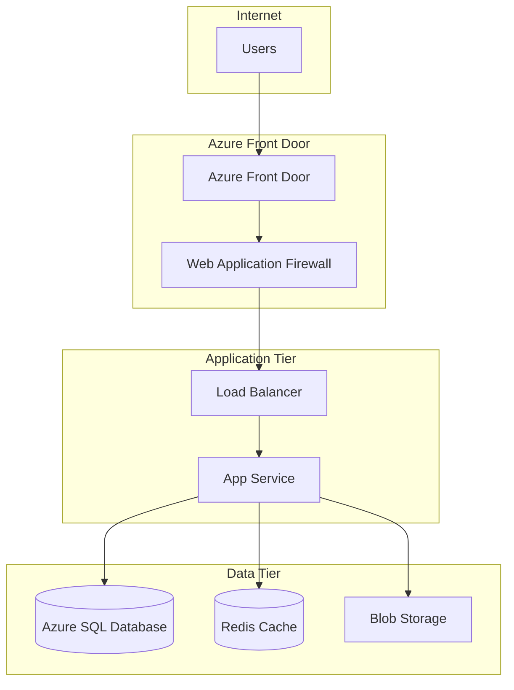
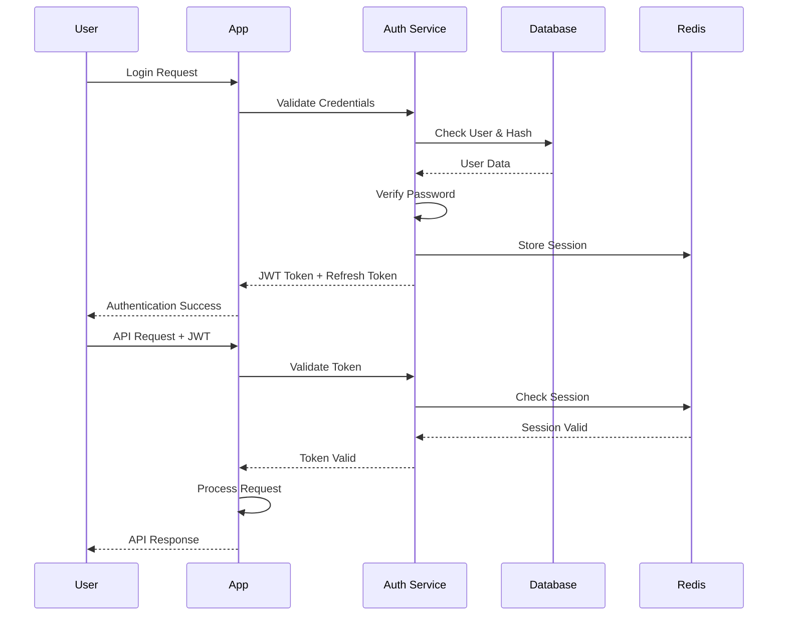

# Security Policy


## 🔒 Security Overview

DealersCloud takes security seriously. This document outlines our security policies, procedures, and guidelines for reporting security vulnerabilities.

## 📋 Table of Contents

- [Supported Versions](#supported-versions)
- [Reporting Security Issues](#reporting-security-issues)
- [Security Features](#security-features)
- [Best Practices](#best-practices)
- [Security Architecture](#security-architecture)
- [Data Protection](#data-protection)
- [Compliance](#compliance)

## ✅ Supported Versions

We provide security updates for the following versions:

| Version | Supported          |
| ------- | ------------------ |
| 1.0.x   | ✅ Active support  |
| 0.9.x   | ⚠️ Critical fixes only |
| < 0.9   | ❌ No longer supported |

## 🚨 Reporting Security Issues

**Please DO NOT report security vulnerabilities through public GitHub issues.**

### Responsible Disclosure

If you discover a security vulnerability, please report it privately:

1. **Email**: security@dealerscloud.com
2. **Subject**: Security Vulnerability Report
3. **Include**:
   - Description of the vulnerability
   - Steps to reproduce
   - Potential impact
   - Suggested fix (if any)

### Response Timeline

- **Initial Response**: Within 24 hours
- **Assessment**: Within 72 hours
- **Fix Timeline**: 
  - Critical: Within 7 days
  - High: Within 30 days
  - Medium: Within 90 days
  - Low: Next scheduled release

### What to Expect

1. **Acknowledgment**: We'll confirm receipt of your report
2. **Investigation**: We'll investigate and validate the issue
3. **Fix Development**: We'll develop and test a fix
4. **Release**: We'll release the fix and notify you
5. **Credit**: We'll credit you in our security advisories (if desired)

## 🛡️ Security Features

### Authentication & Authorization

- **JWT-based Authentication**: Secure token-based authentication
- **Role-based Access Control (RBAC)**: Granular permission system
- **Password Hashing**: bcrypt with salt rounds
- **Session Management**: Secure session handling with Redis
- **Multi-factor Authentication**: Planned for future release

### Data Protection

- **Data Encryption**:
  - At rest: SQL Server TDE (Transparent Data Encryption)
  - In transit: TLS 1.3 for all connections
  - Application level: Sensitive data encrypted with AES-256

- **Input Validation**: Comprehensive input sanitization
- **SQL Injection Prevention**: Parameterized queries
- **XSS Protection**: Input sanitization and Content Security Policy

### Network Security

- **HTTPS Only**: All production traffic over HTTPS
- **CORS Configuration**: Restricted cross-origin requests
- **Rate Limiting**: API endpoint protection
- **Firewall Rules**: Database and Redis access restrictions

### File Upload Security

- **File Type Validation**: Whitelist of allowed file types
- **File Size Limits**: Configurable upload size limits
- **Virus Scanning**: Integration with cloud-based scanning
- **Secure Storage**: Files stored in Azure Blob Storage with private access

## 🔐 Best Practices

### For Developers

#### Secure Coding Practices

```javascript
// ✅ Good - Parameterized query
const getUserByEmail = async (email) => {
  const query = 'SELECT * FROM Users WHERE email = @email';
  const result = await db.request()
    .input('email', sql.NVarChar, email)
    .query(query);
  return result.recordset[0];
};

// ❌ Bad - SQL injection vulnerability
const getUserByEmail = async (email) => {
  const query = `SELECT * FROM Users WHERE email = '${email}'`;
  return await db.query(query);
};
```

#### Input Validation

```javascript
// ✅ Good - Validate and sanitize input
const validateUserInput = (req, res, next) => {
  const { email, password } = req.body;
  
  if (!validator.isEmail(email)) {
    return res.status(400).json({ error: 'Invalid email format' });
  }
  
  if (!validator.isLength(password, { min: 8 })) {
    return res.status(400).json({ error: 'Password must be at least 8 characters' });
  }
  
  req.body.email = validator.normalizeEmail(email);
  next();
};
```

#### Error Handling

```javascript
// ✅ Good - Don't expose sensitive information
const handleDatabaseError = (error, res) => {
  logger.error('Database error:', error);
  return res.status(500).json({ 
    error: 'Internal server error',
    timestamp: new Date().toISOString()
  });
};

// ❌ Bad - Exposes database structure
const handleDatabaseError = (error, res) => {
  return res.status(500).json({ error: error.message });
};
```

### For Deployment

#### Environment Variables

```bash
# ✅ Secure environment configuration
JWT_SECRET=your-256-bit-secret-key-here
DB_PASSWORD=complex-random-password
SENDGRID_API_KEY=your-sendgrid-api-key

# Database connection with encryption
DB_ENCRYPT=true
DB_TRUST_SERVER_CERTIFICATE=false
```

#### Security Headers

```javascript
// Express.js security middleware
app.use(helmet({
  contentSecurityPolicy: {
    directives: {
      defaultSrc: ["'self'"],
      styleSrc: ["'self'", "'unsafe-inline'"],
      scriptSrc: ["'self'"],
      imgSrc: ["'self'", "data:", "https:"],
    },
  },
  hsts: {
    maxAge: 31536000,
    includeSubDomains: true,
    preload: true
  }
}));
```

## 🏗️ Security Architecture

### Network Architecture



### Authentication Flow



## 📊 Data Protection

### Data Classification

| Classification | Examples | Security Controls |
|----------------|----------|-------------------|
| **Public** | Marketing materials | Basic access controls |
| **Internal** | User preferences | Authentication required |
| **Confidential** | Customer PII | Encryption + Access controls |
| **Restricted** | Payment data | Strong encryption + Audit logs |

### Data Retention

- **Customer Data**: Retained per legal requirements
- **Audit Logs**: 2 years retention
- **Session Data**: 30 days in Redis
- **File Uploads**: Until deletion request

### Data Anonymization

```javascript
// Example: Anonymize customer data for analytics
const anonymizeCustomerData = (customerData) => {
  return {
    ...customerData,
    firstName: hash(customerData.firstName),
    lastName: hash(customerData.lastName),
    email: hash(customerData.email),
    phone: hash(customerData.phone),
    // Keep non-PII data for analytics
    city: customerData.city,
    state: customerData.state,
    leadSource: customerData.leadSource,
  };
};
```

## 🎯 Compliance

### Standards & Regulations

- **GDPR**: European data protection compliance
- **CCPA**: California privacy law compliance
- **SOX**: Financial reporting controls (if applicable)
- **PCI DSS**: Payment card data security (if processing payments)

### Audit & Monitoring

#### Security Logging

```javascript
// Security event logging
const securityLogger = winston.createLogger({
  level: 'info',
  format: winston.format.combine(
    winston.format.timestamp(),
    winston.format.json()
  ),
  transports: [
    new winston.transports.File({ filename: 'logs/security.log' }),
    new winston.transports.Console()
  ]
});

// Log authentication events
const logAuthEvent = (event, userId, ip, success) => {
  securityLogger.info('AUTH_EVENT', {
    event,
    userId,
    ip,
    success,
    timestamp: new Date().toISOString()
  });
};
```

#### Monitoring Alerts

- **Failed Login Attempts**: > 5 attempts in 15 minutes
- **Unusual Data Access**: Large data exports
- **API Rate Limiting**: Exceeded rate limits
- **System Errors**: 5xx error rates

## 🚀 Security Testing

### Automated Security Testing

```bash
# npm audit for vulnerability scanning
npm audit

# ESLint security rules
npm run lint:security

# OWASP dependency check
npm run security:check
```

### Manual Security Testing

1. **Penetration Testing**: Annual third-party testing
2. **Code Review**: Security-focused code reviews
3. **Vulnerability Assessment**: Quarterly assessments

### Security Test Cases

```javascript
// Example security test
describe('Authentication Security', () => {
  it('should prevent brute force attacks', async () => {
    const attempts = Array(10).fill().map(() =>
      request(app)
        .post('/api/login')
        .send({ username: 'test', password: 'wrong' })
    );

    const responses = await Promise.all(attempts);
    const lastResponse = responses[responses.length - 1];
    
    expect(lastResponse.status).toBe(429); // Too Many Requests
    expect(lastResponse.body.error).toContain('Too many attempts');
  });
});
```

## 🔧 Security Configuration

### Environment-specific Security

#### Development
```javascript
const devSecurityConfig = {
  cors: {
    origin: ['http://localhost:3000', 'http://localhost:8081'],
    credentials: true
  },
  rateLimiting: {
    windowMs: 15 * 60 * 1000, // 15 minutes
    max: 1000 // requests per window
  }
};
```

#### Production
```javascript
const prodSecurityConfig = {
  cors: {
    origin: process.env.ALLOWED_ORIGINS?.split(',') || [],
    credentials: true
  },
  rateLimiting: {
    windowMs: 15 * 60 * 1000, // 15 minutes
    max: 100 // requests per window
  }
};
```

### Database Security

```sql
-- Create dedicated application user
CREATE USER dealerscloud_app WITH PASSWORD 'strong_random_password';

-- Grant minimal required permissions
GRANT SELECT, INSERT, UPDATE, DELETE ON customer_data TO dealerscloud_app;
GRANT SELECT, INSERT, UPDATE, DELETE ON vehicle_inventory TO dealerscloud_app;

-- Revoke dangerous permissions
REVOKE CREATE, DROP, ALTER ON DATABASE FROM dealerscloud_app;
```

## 📞 Security Contacts

### Internal Team
- **Security Lead**: security-team@dealerscloud.com
- **DevOps Team**: devops@dealerscloud.com
- **Compliance Officer**: compliance@dealerscloud.com

### External Resources
- **Security Consultant**: [Contact Information]
- **Penetration Testing Firm**: [Contact Information]
- **Legal Counsel**: [Contact Information]

## 🏆 Security Recognition

We recognize and thank the following security researchers for their responsible disclosure:

<!-- Future security researcher acknowledgments -->

## 📚 Additional Resources

### Security Training
- [OWASP Top 10](https://owasp.org/www-project-top-ten/)
- [Node.js Security Best Practices](https://nodejs.org/en/docs/guides/security/)
- [React Native Security Guide](https://reactnative.dev/docs/security)

### Security Tools
- **Static Analysis**: ESLint with security plugins
- **Dependency Scanning**: npm audit, Snyk
- **Runtime Protection**: Helmet.js, CORS
- **Monitoring**: Application Insights, LogRocket

---

## 📝 Security Changelog

### Version 1.0.0 (Current)
- Initial security policy implementation
- JWT authentication with refresh tokens
- Role-based access control
- Input validation and sanitization
- Secure file upload handling
- Database encryption and connection security

---

**For security questions or concerns, please contact**: security@dealerscloud.com

**Last Updated**: January 2025  
**Policy Version**: 1.0.0